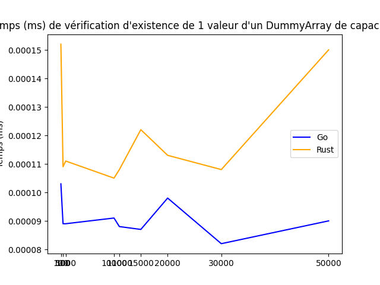

# Dummy arrays

## General conception and implementation 📑
This little project aims to implement _an associative data structure_, called Dummy-array. 
It would works around three entities, as follows :
- one sub data structure _for indexing_.
- another _to store values_.
- and a counter _to keep track of the next index to write onto_.

The idea is to _access only the first sub data structure_, containing **pointers to the other one** where the values are stored.
Both sub data structures have the same lenght, and **the indexes of the first one** define the value the relative pointer
is **expected to point to**. In other words, the **lenght-1 of the dummy-array corresponds to the maximum value** it can store (from
0 to lenght-1).

This data structure must implements three methods :
- **`exists(int value)`** -> return True if the given value is already stored; else False.
- **`add(int value)`** -> if the given values is not already stored, insert it and return True; else return False.
- **`remove(int value)`** -> if the given value is already stored, delete it and return True; else return False.

For example, if the pointer at _index 3 does not point to a slot containing 3_, **it means the value isn't stored** in the dummy-array.
To mark a slot as _writtable in the storing sub data structure_, it is **field with the lenght of the dummy-array**. So if we want to 
add a value we therefore need to search for _the first slot marked thus_. And remove a value is as simple as _write the lenght in the 
concerned slot_.
Every operation, execpt the initialization, should be process from the indexing sub data structure, by dereferencing.

## Download and setup 🚂 
If you'd like to try it out for yourself, we've set up a _ready-to-use_ VirtualBox virtual machine for you. You can download it here: 
https://drive.google.com/drive/folders/1BeF5Shekm3_1Yu0PrnhrARvdkd775yvi?usp=sharing  
Then, open VirtualBox and select **`"Import a virtual device..."`** in the **`File`** menu on top-left of the window. 
Finally, select the file you just downloaded.

Once you launched the VM, use the following infos **to login** : **`login: benchmaker`** and **`passwrd: plop`**. 
Then you can just **run the setup script** by typing the following command : **`bash setup.sh`**. 
Taadaa, you're **ready to explore** our dummy-array project !  
 
You can run a benchmark within the python virtual environnement in the **`visualization`** directory; or compile and test yourself our 
dummy-array implementations from the directories **`go`** and **`rust`**. 
 
<ins>NB</ins>: to compile one or the other, you can use the respectives building scripts in the **`scripts`** directory.

## Benchmark 📊
We so choose to implement a Dummy-array in Go and Rust, then compared the results between the two languages during the benchmark.

The following graphs show the results of the three methods, **add**, **remove** and **exists**. The Rust implementation is **always faster** than the Go one, exept for the initialization. 

As we can se on the graph below, the Rust implementation is suprisingly slower than the Go one.
It can be due to the fact that the dummy-array values must be initialized. 
 

As we can see on the graph bellow, the Rust implementation is **way faster** than the Go one. Its **more than 10 times faster**. 
Noting that the complexity is **O(1)** for Rust and **O(n)** for Go. 
 

As we can see on the graph bellow, the Rust implementation still **way faster** than the Go one. But the complexity is now **O(n)** for both. 
It can be explain by the fact that after removing a value, the counter must be refreshed. 
 

Same as the add benchmark, the Rust implementation is **way faster** than the Go one. 
The complexity still is **O(1)** for Rust and **O(n)** for Go. 
 

