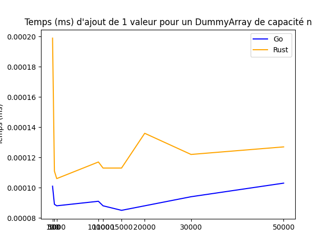

exit# Dummy arrays

## Conception générale et mise en œuvre 📑
Ce petit projet a pour but d'implémenter _une structure de données associative_, appelée Dummy-array. 
Celle-ci devrait s'organiser autour de trois entités, comme suit :
- une sous-structure _pour l'indexage_.
- une autre _pour le stockage des valeurs_.
- et un compteur _pour garder une trace du prochain indice sur lequel écrire_.

L'idée est d'accéder uniquement à la première sous-structure, contenant **des pointeurs vers l'autre** où les valeurs sont stockées.
Les deux sous-structures ont la même longueur, et **les index de la première** définissent la valeur à laquelle le pointeur relatif
est **censé pointer**. En d'autres termes, la **longueur-1 du dummy-array correspond à la valeur maximale** qu'elle peut stocker (de
0 à longueur-1).

Cette structure de données doit implémenter trois méthodes :
- **`exists(int value)`** -> retourne True si la valeur donnée est déjà stockée ; sinon False.
- **`add(int value)`** -> si la valeur donnée n'est pas déjà stockée, l'insérer et retourner True ; sinon retourner False.
- **`remove(int value)`** -> si la valeur donnée est déjà stockée, la supprimer et retourner True ; sinon retourner False.

Par exemple, si le pointeur à _l'index 3 ne pointe pas vers un emplacement contenant 3_, **cela signifie que la valeur n'est pas stockée** dans le dummy-array.
Pour marquer un emplacement comme _écrivable dans la sous-structure de stockage_, il est **rempli avec la longueur du dummy-array**. Donc, si nous voulons
ajouter une valeur, nous devons donc rechercher _le premier emplacement marqué ainsi_. Et supprimer une valeur est aussi simple que _d'écrire la longueur dans
l'emplacement concerné_.
Toute opération, sauf l'initialisation, doit être traitée à partir de la sous-structure d'indexation, par déréférencement.

## Téléchargement et configuration 🚂
Si vous souhaitez l'essayer par vous-même, nous avons configuré une machine virtuelle VirtualBox prête à l'emploi pour vous. Vous pouvez la télécharger ici : 
https://drive.google.com/drive/folders/1BeF5Shekm3_1Yu0PrnhrARvdkd775yvi?usp=sharing  
Ensuite, ouvrez VirtualBox et sélectionnez **`"Importer un appareil virtuel..."`** dans le menu **`Fichier`** en haut à gauche de la fenêtre. 
Enfin, sélectionnez le fichier que vous venez de télécharger.

Une fois que vous avez lancé la VM, utilisez les informations suivantes **pour vous connecter** : **`login: benchmaker`** et **`passwrd: plop`**. 
Ensuite, vous pouvez simplement **exécuter le script de configuration** en tapant la commande suivante : **`bash setup.sh`**. 
Tadaa, vous êtes **prêt à explorer** notre projet dummy-array !  
 
Vous pouvez exécuter un benchmark dans l'environnement virtuel Python dans le répertoire **`visualization`** et visualiser les résultats dans le répértoire **`graph`**; ou compiler et tester vous-même nos
implémentations de dummy-array à partir des répertoires **`go`** et **`rust`**. 
 
<ins>NB</ins>: pour compiler l'un ou l'autre, vous pouvez utiliser les scripts de construction respectifs dans le répertoire **`scripts`**.

## Benchmark 📊
Nous avons choisi d'implémenter un Dummy-array en Go et Rust, puis de comparer les résultats entre les deux langages lors du benchmark.
Les graphiques suivants montrent les résultats des trois méthodes, **add**, **remove** et **exists**.

Comme nous pouvons le voir sur le graphique ci-dessous, l'implémentation en Rust est plus lente que celle en Go lorsqu'il s'agit d'initialiser un dummy-array. 
Cela peut être dû au fait que les valeurs du dummy-array doivent être obligatoirement initialisées en Rust. 
 

Concernant l'ajout d'une valeur les deux implémentations semble donner des résultats plus ou moins similaires, à quelques nanosecondes près, 
avec tout de même une légère ascendance pour Go.  
A noter que la complexité de cette opération reste O(1).  
 

Comme nous pouvons le voir sur le graphique ci-dessous, les résultats pour la suppression d'un élément sont relativement les même que pour l'ajout.  
Bien que dans ce cas on observe une légère ascendance pour Rust plutôt que Go.  
La complexité de cette opération est également O(1).  
 

Enfin, pour ce qui est de la recherche d'un élément, l'implémentation en Go semble un peu plus rapide.  
La complexité de cette opération est O(n).  
 

